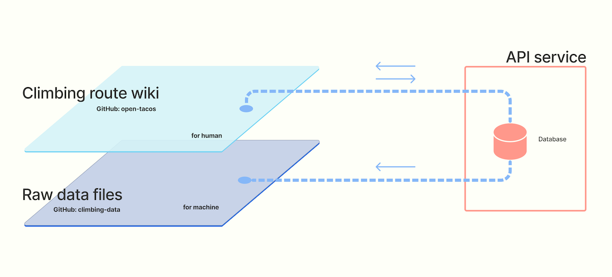

# Technical overview

We publish climbing content ("data") in two forms, *human-readable* and *machine-readable*.  

Two representations of the same data address multiple community needs.  Benefits of open access to machine-readabe climbing data:
- Allow independent developers to build on and enrich the existing ecosystem.  
- Provide data science students with much needed datasets. 
- Increase the efficiency of public research related to climbing.

### Climbing route wiki 

Inspired by Wikipedia and OpenStreetMap, the web application (code name OpenTacos) provides the climbing community with a searchable catalog of climbing routes.

- Work-in-progress: Crag finder.
- Planned feature: Collaborative editing.

> Live site: https://tacos.openbeta.io  
> Source code: https://github.com/openbeta/open-tacos

### Climbing data

Climbing datasets in CSV, jsonlines, and Python pickle format.

> Source code: https://github.com/openbeta/climbing-data

### API service

A GraphQL-based API that provides data for OpenTacos.  We plan to open the API to public at some point in 2022.  Be sure to [subscribe to the newsletter](/stay-connected).

> Source code: https://github.com/openbeta/openbeta-graphql
