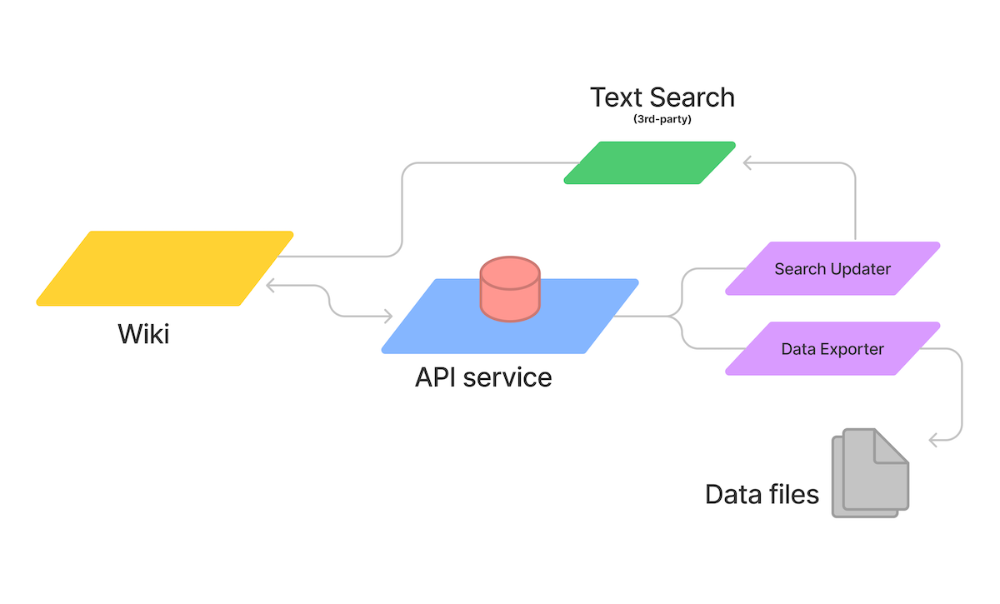

The API Servive is the source-of-truth.  It provides data for:
- The wiki (OpenTacos)
- External text search service
- Data exporter service

:::info
If reading code is your things, here are direct links to those projects on GitHub:
- **Wiki**: [https://github.com/OpenBeta/open-tacos](https://github.com/OpenBeta/open-tacos)
- **API Service**: [https://github.com/OpenBeta/openbeta-graphql](https://github.com/OpenBeta/openbeta-graphql)
- **Search updater**: lives inside the API Service
- **Data exporter**: TBD
- **Climbing data**: [https://github.com/OpenBeta/climbing-data](https://github.com/OpenBeta/climbing-data)
:::